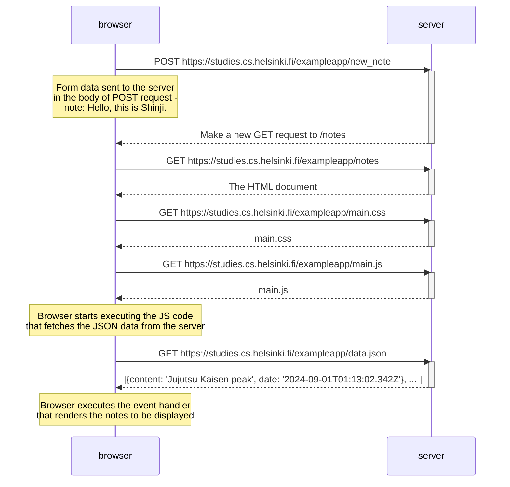

```mermaid
sequenceDiagram
    participant browser
    participant server

    browser->>server: POST https://studies.cs.helsinki.fi/exampleapp/new_note
    activate server
    Note over browser: Form data sent to the server<br>in the body of POST request -<br>note: Hello, this is Shinji.
    server-->>browser: Make a new GET request to /notes
    deactivate server

    browser->>server: GET https://studies.cs.helsinki.fi/exampleapp/notes
    activate server
    server-->>browser: The HTML document
    deactivate server

    browser->>server: GET https://studies.cs.helsinki.fi/exampleapp/main.css
    activate server
    server-->>browser: main.css
    deactivate server

    browser->>server: GET https://studies.cs.helsinki.fi/exampleapp/main.js
    activate server
    server-->>browser: main.js
    deactivate server

    Note over browser: Browser starts executing the JS code<br>that fetches the JSON data from the server

    browser->>server: GET https://studies.cs.helsinki.fi/exampleapp/data.json
    activate server
    server-->>browser: [{content: 'Jujutsu Kaisen peak', date: '2024-09-01T01:13:02.342Z'}, ... ]
    deactivate server

    Note over browser: Browser executes the event handler<br>that renders the notes to be displayed
```
