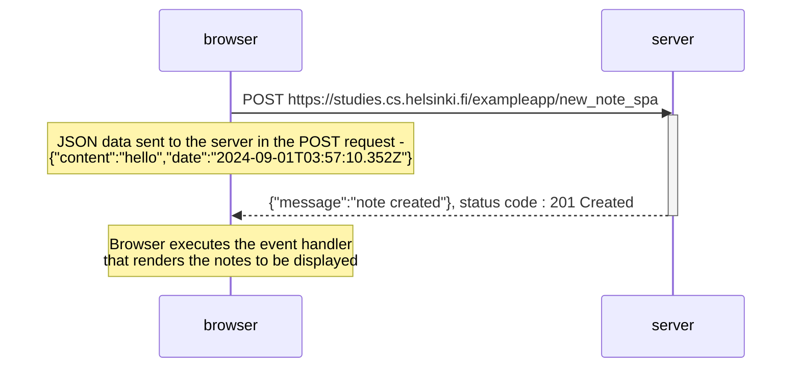

```mermaid
sequenceDiagram
    participant browser
    participant server

    browser->>server: POST https://studies.cs.helsinki.fi/exampleapp/new_note_spa
    activate server
    Note over browser: JSON data sent to the server in the POST request -<br>{"content":"hello","date":"2024-09-01T03:57:10.352Z"}
    server-->>browser: {"message":"note created"}, status code : 201 Created
    deactivate server

    Note over browser: Browser executes the event handler<br>that renders the notes to be displayed
```
